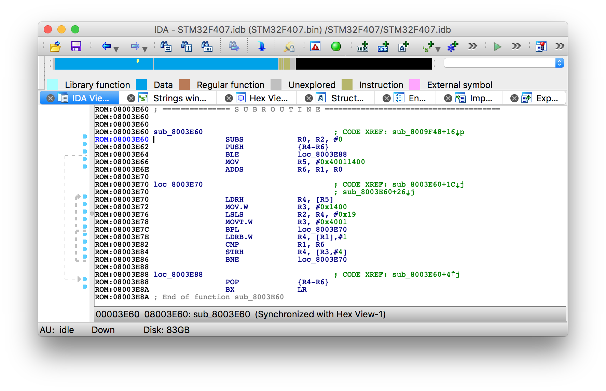
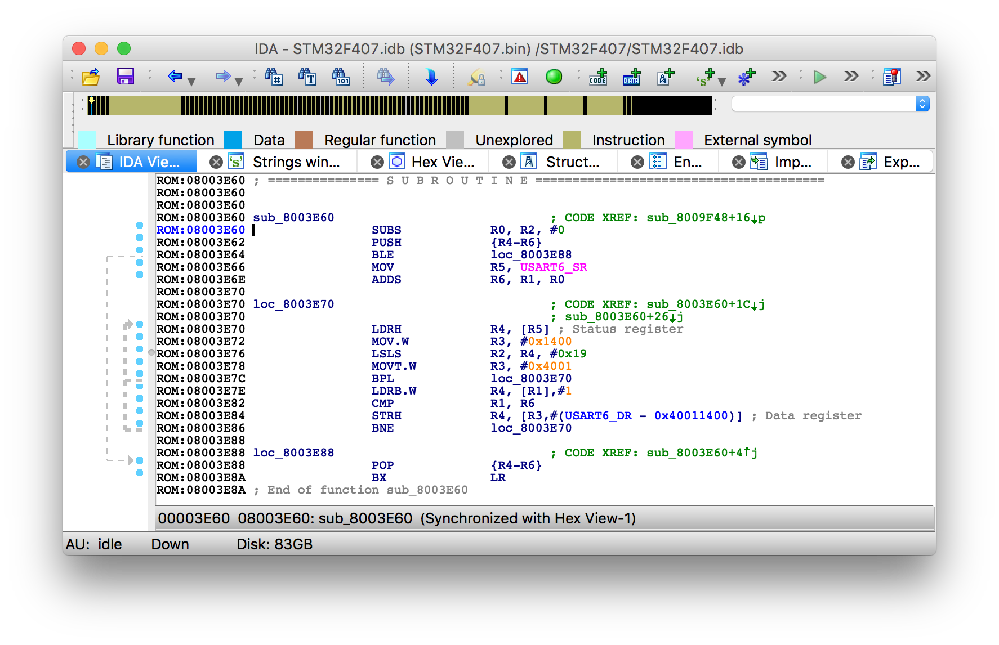
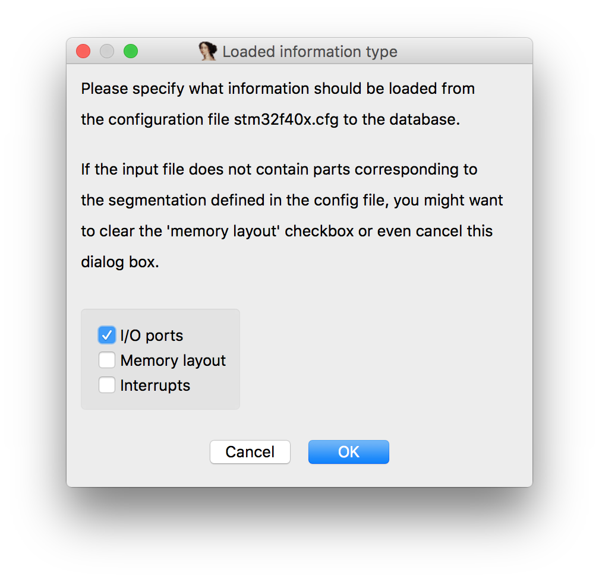

## Overview
**LoadProcConfig** is an IDA Plugin to load processor configuration files.

With just a couple of clicks configuration files can turn this:

Into this, adding memory regions, entries and registers/ports:

By default IDA is shipped with configuration files for many processors in **IDA/cfg** folder. These configuration files are loaded automatically when corresponding processor module is loaded.  

However, this approach has some disadvantages:  
1. You have to keep your own configuration files inside IDA  
2. There is no easy way to load and apply configuration file on existing database  
3. Most important, ARM processor module doesn't have configuration file  

Current plugin was implemented to address all these issues.

## Installation

Just copy **LoadProcConfig.pmc** and **LoadProcConfig.pmc64** to IDA plugins folder.

## Usage

From **Edit / Plugins** menu choose **Load Processor Config**.  
Then open configuration file using the file dialog.
IDA will parse this file and display all available devices.  
Pick your device and press **OK**.  

Choose what do you want to load from this configuration file.

Plugin will reanalyse entire database using device description and create additional memory regions.

## Configuration files

There are many configuration files in **IDA/cfg** folder. While the format has no proper documentation, we can get some ideas by looking into **idasdk/module/iocommon.cpp**

Every configuration includes following parts:

```
; Default device in current configuration file
.default MYDEVICE

; Device description
.MYDEVICE

; RAM/FLASH specification
RAM=512
ROM=8192
EEPROM=512

; Memory Map
area DATA I_SRAM    0x00060:0x00260  Internal SRAM
area DATA E_SRAM    0x00260:0x10000  External SRAM

; Interrupts and reset vector assignments 
entry RESET         0x0000   External Reset, Power-on Reset and Watchdog Reset
entry UART_RX       0x0009   UART, Rx Complete

; Registers (with bit fields)
USR                 0x000B   UART Status Register
USR.RXC              7   UART Receive Complete
USR.TXC              6   UART Transmit Complete
USR.UDRE             5   UART Data Register Empty
USR.FE               4   Framing Error
USR.OR               3   Overrun
```

You can find example for STM32F40x in **Configurations** folder
